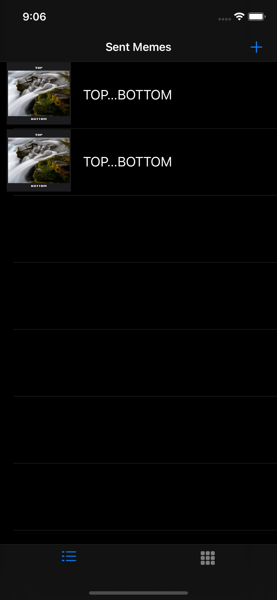
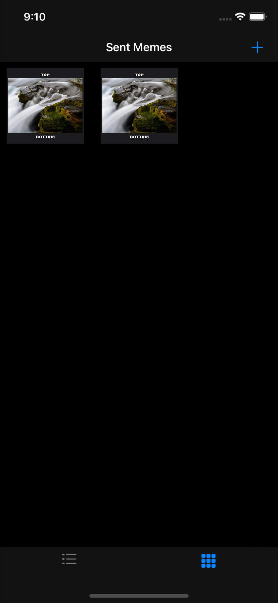
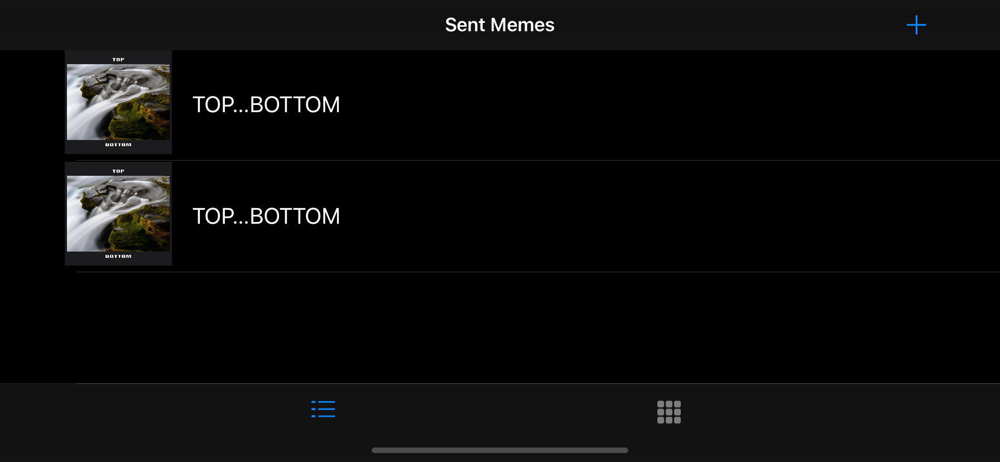
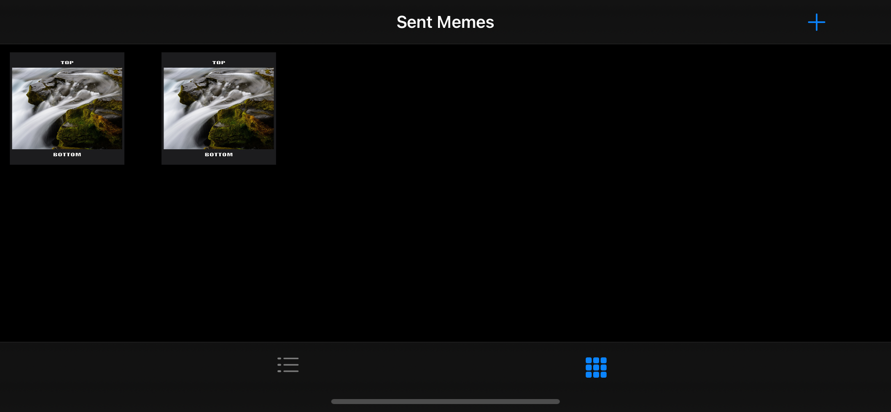
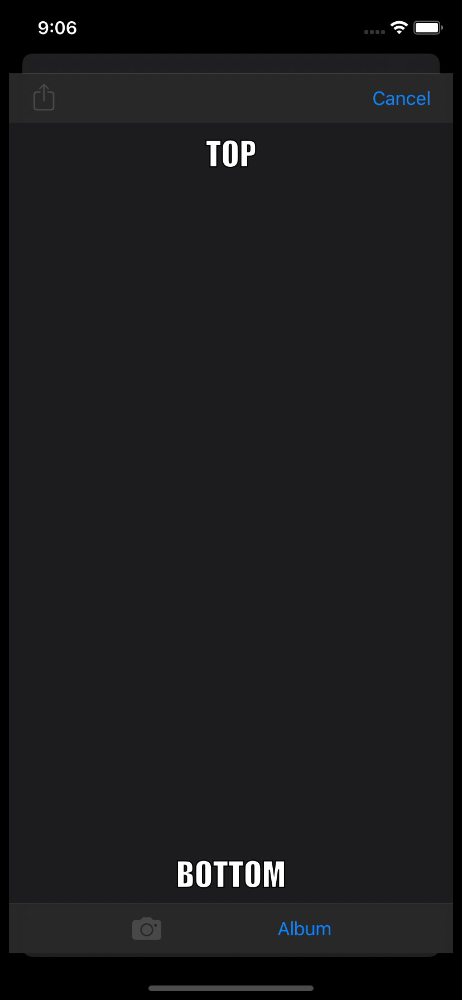
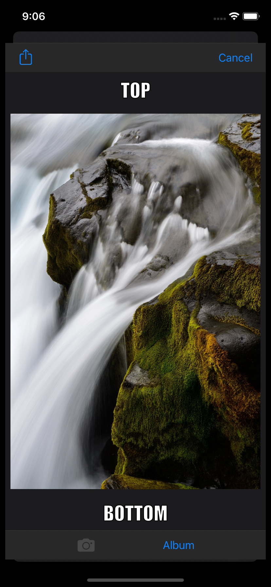
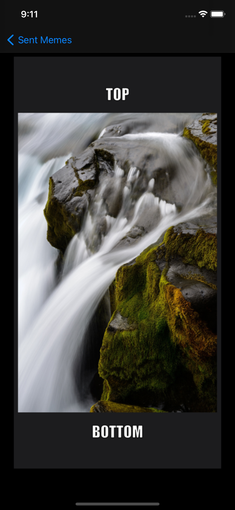
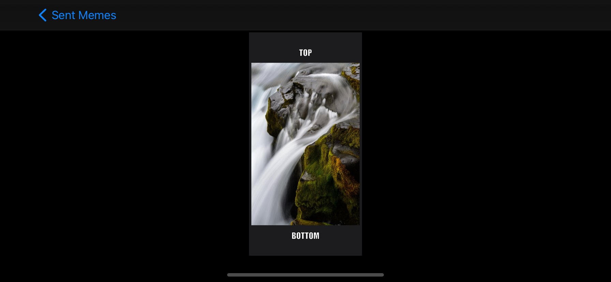

# MemeMe 2.0 App

Second project of the [iOS Developer Nanodegree course](https://www.udacity.com/course/ios-developer-nanodegree--nd003).

## Getting Started

Download the project from [Github](https://github.com/RicardoBravoA/MemeMe-2), the updated branch is **main**

## Project Instructions

The project has this features.

    
    
    
    
   
    
    
    

- Main
    - List View.
    - Grid View.
    - Aaction to add Meme.
- Add Meme
    - Add Header and Footer.
    - Select Picture from Gallery or take a photo.
    - Share Meme
- Detail
    - Show Meme selected from main view.

## License

    Copyright 2021 Ricardo Bravo (Woz).

    Licensed under the Apache License, Version 2.0 (the "License");
    you may not use this file except in compliance with the License.
    You may obtain a copy of the License at

       http://www.apache.org/licenses/LICENSE-2.0

    Unless required by applicable law or agreed to in writing, software
    distributed under the License is distributed on an "AS IS" BASIS,
    WITHOUT WARRANTIES OR CONDITIONS OF ANY KIND, either express or implied.
    See the License for the specific language governing permissions and
    limitations under the License.